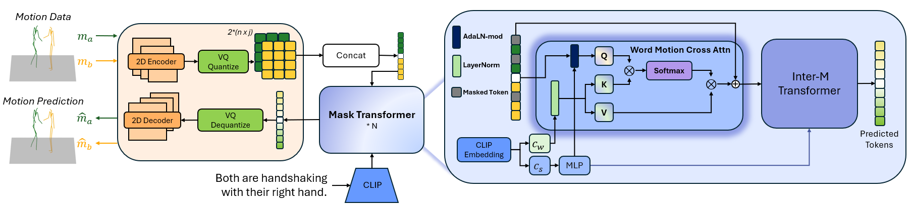

# InterMask: 3D Human Interaction Generation via Collaborative Masked Modeling

 <p align="center">
    <a href="https://gohar-malik.github.io/intermask/"></a>
    <a href="https://arxiv.org/abs/2410.10010"></a>
  </p>



If you find our code or paper helpful, please consider starring our repository and citing:
```
@inproceedings{javed2025intermask,
  title={InterMask: 3D Human Interaction Generation via Collaborative Masked Modeling},
  author={Muhammad Gohar Javed and Chuan Guo and Li Cheng and Xingyu Li},
  booktitle={The Thirteenth International Conference on Learning Representations},
  year={2025},
  url={https://openreview.net/forum?id=ZAyuwJYN8N}
}
```

## :star2: Project Summary

This repository extends the [InterMask](https://github.com/tr3e/InterGen) baseline for two-person interaction motion generation with key improvements focused on fine-grained text understanding and training efficiency.

### Baseline: InterMask Architecture

The baseline InterMask model uses:
- **VQ-VAE**: Converts continuous motion data into discrete motion tokens for efficient representation
- **Masked Transformer**: Generates motion tokens from text in an iterative prediction process
- **Training Pipeline**: Two-stage training (VQ-VAE tokenization → Transformer generation)

### Our Key Contributions

#### 1. Word-Motion Cross Attention (Primary Contribution)
**Problem**: The baseline InterMask uses only sentence-level embeddings through AdaLN (Adaptive Layer Normalization), which fails to capture fine-grained word-level instructions such as "left" vs "right" or specific body part mentions like "hand" vs "leg".

**Our Solution**:
- Introduces a **Word-Motion Cross Attention layer** positioned before the Inter-M Transformer
- **Architecture**:
  - **Query**: Concatenated motion features from both interacting persons
  - **Key/Value**: Word-level embeddings extracted from CLIP text encoder
  - Uses standard LayerNorm (instead of AdaLN) to preserve word-level semantic information
- **Benefits**:
  - Captures fine-grained directional instructions ("left hand", "right leg")
  - Better understanding of specific body part specifications
  - Improved text-motion alignment for detailed action descriptions
  - Enhanced R-Precision and FID metrics

**Technical Details**:
- **Attention Mechanism**: Allows the model to focus on relevant parts of input sequences by computing weighted relationships
- **Cross Attention**: Enables motion features to attend to word-level text information, creating explicit connections between text tokens and motion representations
- Applied in the concatenated feature space (both persons) to capture interaction context before individual modeling

#### 2. Multi-GPU Distributed Training (DDP)
The baseline code only supports single-GPU training, requiring high-end GPUs like A100. We implemented PyTorch DDP (Distributed Data Parallel):

**Key Features**:
- **DDP-aware random number generation**: Ensures mathematical equivalence to single-GPU training
- **ChunkDistributedSampler**: Custom data sampler that splits batches sequentially across GPUs (not interleaving)
- **Synchronized seeds**: All GPUs use identical random seeds for reproducibility
- **Gradient synchronization**: Gradients from all GPUs are averaged during backpropagation

**Benefits**:
- Enables training on standard RTX GPUs without requiring high VRAM
- Maintains identical training dynamics to single-GPU mode
- Reduces memory requirements by distributing workload across multiple GPUs

#### 3. WandB Integration
Added Weights & Biases logging for:
- Real-time training monitoring (loss curves, metrics)
- Experiment tracking and comparison across multiple runs
- Comprehensive logging of hyperparameters and evaluation metrics

## :round_pushpin: Preparation

<details>
  
### 1. Setup Environment
```
conda env create -f environment.yml
conda activate hhi
```
The code was tested on Python 3.7.7 and PyTorch 1.13.1

### 2. Models and Dependencies

#### Download Pre-trained Models
The following script will download pre-trained model checkpoints for both the **VQ-VAE** and **Inter-M Transformer** on both the **InterHuman** and **Inter-X** datasets.
```
python prepare/download_models.py
```

#### Download Evaluation Models
For evaluation on InterHuman dataset only (obtained from the [InterGen github repo](https://github.com/tr3e/InterGen/tree/master)). Evaluation models for Inter-X dataset can be downloaded alongwith the dataset as explained later.
```
bash prepare/download_evaluator.sh
```

The download scripts use the [gdown](https://github.com/wkentaro/gdown) package. If you face problems, try running the following command and try again. The solution is from this [github issue](https://github.com/wkentaro/gdown/issues/110#issuecomment-913561232).
```
rm -f ~/.cache/gdown/cookies.json
```

#### Download SMPL-X (Only for Inter-X)
You need to download the [SMPL-X models](https://smpl-x.is.tue.mpg.de/) and then place them under `./data//body_models/smplx`.

```
├── SMPLX_FEMALE.npz
├── SMPLX_FEMALE.pkl
├── SMPLX_MALE.npz
├── SMPLX_MALE.pkl
├── SMPLX_NEUTRAL.npz
├── SMPLX_NEUTRAL.pkl
└── SMPLX_NEUTRAL_2020.npz
```

### 3. Get Data

#### InterHuman
Follow the instructions on the [InterGen github repo](https://github.com/tr3e/InterGen/tree/master?tab=readme-ov-file#2-get-data) to download the InterHuman dataset and place it in the `./data/InterHuman/` foler and unzip the `motions_processed.zip` archive such that the directory structure looks like:
```
./data
├── InterHuman
    ├── annots
    ├── LICENSE.md
    ├── motions
    ├── motions_processed
    └── split
```

#### Inter-X
Follow the intstructions on the [Inter-X github repo](https://github.com/liangxuy/Inter-X?tab=readme-ov-file#dataset-download) to download the Inter-X dataset and place it in the `./data/Inter-X_Dataset` folder and unzip the `processed/texts_processed.tar.gz` archive, such that the directory structure looks like:
```
./data
├── Inter-X_Dataset
    ├── annots
    ├── misc
    ├── processed
        ├── glove
        ├── motions
        ├── texts_processed
        └── inter-x.h5
    ├── splits
    ├── text2motion
    └── LICENSE.md
```

**For Inter-X Evaluation Models**

Once you have downloaded the dataset, move the contents of the `./data/Inter-X_Dataset/text2motion/checkpoints/` folder to the `./checkpoints/hhi/` folder. 

</details>

## :rocket: Demo
<details>

```
python infer.py --gpu_id 0 --dataset_name interhuman --name trans_default
```

The inference script obtains text prompts from the file `./prompts.txt`. The format is each text prompt per line. By default the script generateds motion of 3 seconds in length. In our work, motion is in 30 fps.

The output files are stored under folder `./checkpoints/<dataset_name>/<name>/animation_infer/`, which is this case would be `./checkpoints/interhuman/trans_default/animation_infer/`. The output files are organized as follows:
* `keypoint_npy`: generated motions with shape of (nframe, 22, 9) for each interacting individual.
* `keypoint_mp4`: stick figure animation in mp4 format with two viewpoints.

We also apply naive foot ik to the generated motions, see files with prefix `ik_`. It sometimes works well, but sometimes will fail.

### Example Results

<p align="center">
  <video src="https://github.com/user-attachments/assets/infer_best_fid_ts20_cs2_topkr0.9_02_00.mp4" width="600">
</p>

*Sample two-person interaction motion generated from text prompt.*

Alternatively, view the demo video: [assets/infer_best_fid_ts20_cs2_topkr0.9_02_00.mp4](assets/infer_best_fid_ts20_cs2_topkr0.9_02_00.mp4)

</details>

## :space_invader: Train Your Own Models
<details>


**Note**: You have to train the VQ-VAE **BEFORE** training the Inter-M Transformers. They **CAN NOT** be trained simultaneously.

### Train VQ-VAE
#### Single GPU Training
On InterHuman dataset:
```
python train_vq.py --gpu_id 0 --dataset_name interhuman --name vq_test
```
On Inter-X dataset:
```
python train_vq.py --gpu_id 0 --dataset_name interx --batch_size 128 --name vq_test
```

#### Multi-GPU Training with DDP
For training on multiple GPUs (e.g., 4 GPUs) to overcome VRAM limitations:

On InterHuman dataset (default batch_size=256 per GPU, total=256×4=1024):
```bash
torchrun --nproc_per_node=4 train_vq.py --distributed --dataset_name interhuman --name vq_ddp_test
```

On Inter-X dataset (batch_size=32 per GPU, total=32×4=128):
```bash
torchrun --nproc_per_node=4 train_vq.py --distributed --dataset_name interx --batch_size 32 --name vq_ddp_test
```

**Important**: The `--batch_size` argument specifies the **per-GPU batch size**. The total effective batch size is `batch_size × num_GPUs`.

**DDP Features:**
- **Mathematical equivalence**: Produces identical results to single-GPU training through DDP-aware random sampling
- **ChunkDistributedSampler**: Splits batches sequentially across GPUs for consistency
- **Synchronized seeds**: Ensures reproducible training across all GPUs
- Enables training on standard RTX GPUs instead of requiring high-end A100s

### Train Inter-M Transformer

#### Single GPU Training
On InterHuman dataset:
```
python train_transformer.py --gpu_id 0 --dataset_name interhuman --name trans_test --vq_name vq_test
```
On Inter-X dataset:
```
python train_transformer.py --gpu_id 0 --dataset_name interx --batch_size 128 --name trans_test --vq_name vq_test
```

#### Multi-GPU Training with DDP
On InterHuman dataset (batch_size=13 per GPU, total=13×4=52):
```bash
torchrun --nproc_per_node=4 train_transformer.py --distributed --dataset_name interhuman --batch_size 13 --name trans_ddp_test --vq_name vq_ddp_test
```

On Inter-X dataset (batch_size=32 per GPU, total=32×4=128):
```bash
torchrun --nproc_per_node=4 train_transformer.py --distributed --dataset_name interx --batch_size 32 --name trans_ddp_test --vq_name vq_ddp_test
```

**Important**: The `--batch_size` argument specifies the **per-GPU batch size**. The total effective batch size is `batch_size × num_GPUs`.

### Word-Motion Cross Attention

The **Word-Motion Cross Attention** layer is integrated into the transformer architecture to improve fine-grained text understanding.

**Key Concept:**
- **Attention mechanism**: Allows the model to focus on relevant parts of input sequences
- **Cross Attention**: One sequence (motion) attends to another sequence (words) to capture relationships
- **Word-level understanding**: Unlike sentence-level embeddings (AdaLN), cross attention captures individual word meanings

**How it works:**
- Positioned before the Inter-M Transformer
- **Query (Q)**: Motion features from both interacting persons (concatenated)
- **Key (K) and Value (V)**: Word-level embeddings from CLIP text encoder
- Captures fine-grained instructions like "left hand", "right leg", specific action verbs

**Benefits:**
- Better text-motion alignment for directional instructions (left/right)
- Improved handling of body part specifications
- Enhanced understanding of interaction details
- Improved R-Precision and FID metrics

This feature is automatically enabled in the transformer training and requires no additional configuration.


### Training Arguments

Selected arguments:
* `--gpu_id`: GPU id (for single GPU training).
* `--distributed`: Enable multi-GPU distributed training with DDP.
* `--dataset_name`: interaction dataset, `interhuman` for InterHuman and `interx` for Inter-X.
* `--name`: name your experiment. This will create a saving directory at `./checkpoints/<dataset_name>/<name>`.
* `--vq_name`: when training Inter-M Transformer, you need to specify the name of previously trained vq-vae model for tokenization.
* `--batch_size`: For InterHuman, we use `256` for VQ-VAE training and `52` for the Inter-M Transformer. For Inter-X, we use `128` for both.
* `--do_eval`: to perform evaluations during training. **Note:** Make sure you have downloaded the evaluation models.
* `--max_epoch`: number of total epochs to run. `50` for VQ-VAE and `500` for Inter-M Transformer.

All the trained model checkpoints, logs and intermediate evaluations will be saved at `./checkpoints/<dataset_name>/<name>`.
</details>

## :book: Evaluation
<details>

### Evaluate VQ-VAE Reconstruction:
InterHuman:
```
python eval.py --gpu_id 0 --use_trans False --dataset_name interhuman --name vq_default

```
Inter-X:
```
python eval.py --gpu_id 0 --use_trans False --dataset_name interx --name vq_default

```

### Evaluate Text to Interaction Generation:
InterHuman:
```
python eval.py --gpu_id 0 --dataset_name interhuman --name trans_default
```
Inter-X:
```
python eval.py --gpu_id 0 --dataset_name interx --name trans_default
```

Selected arguments
* `--gpu_id`: GPU id.
* `--use_trans`: whether to use transformer. default: `True`. Set `False` to perform inference on only the VQ-VAE.
* `--dataset_name`: interaction dataset, `interhuman` for InterHuman and `interx` for Inter-X. 
* `--name`: name of your trained model experiment.
* `--which_epoch`: checkpoint name of the model: [`all`, `best_fid`, `best_top1`, `latest`, `finest`]
* `--save_vis`: whether to save visualization results. default = `True`.
* `--time_steps`: number of iterations for transformer inference. default: `20`.
* `--cond_scales`: scale of classifer-free guidance. default: `2`.
* `--topkr`: percentile of low score tokens to ignore while inference. default: `0.9`.

The final evaluation results will be saved in `./checkpoints/<dataset_name>/<name>/eval/evaluation_<which_epoch>_ts<time_steps>_cs<cond_scales>_topkr<topkr>.log`

</details>

## :bar_chart: WandB Integration

Weights & Biases logging is supported for all training and evaluation scripts (`train_vq.py`, `train_transformer.py`, `eval.py`).

### Setup

**1. Configure your credentials:**

Edit the default values in the options files to add your WandB entity, project name, and API key:
- For VQ-VAE: [`options/vq_option.py`](options/vq_option.py)
- For Transformer: [`options/trans_option.py`](options/trans_option.py)
- For Evaluation: [`options/eval_option.py`](options/eval_option.py)

```python
parser.add_argument('--wandb_entity', type=str, default='YOUR_ENTITY_NAME', help='Wandb entity (team name)')
parser.add_argument('--wandb_project', type=str, default='YOUR_PROJECT_NAME', help='Wandb project name')
parser.add_argument('--wandb_api_key', type=str, default='YOUR_API_KEY', help='Wandb API key for authentication')
```

### Usage

Add `--use_wandb` flag when training or evaluating, and optionally specify a run name with `--wandb_name`:

```bash
# VQ-VAE training
python train_vq.py --gpu_id 0 --dataset_name interhuman --name vq_test --use_wandb --wandb_name my_vq_experiment

# Transformer training
python train_transformer.py --gpu_id 0 --dataset_name interhuman --name trans_test --vq_name vq_test --use_wandb --wandb_name my_transformer_experiment

# Evaluation
python eval.py --gpu_id 0 --dataset_name interhuman --name trans_test --use_wandb --wandb_name my_eval_run
```

**Note:** `--wandb_name` is optional. If not provided, WandB will use a default naming convention.

### What Gets Logged

- Training/evaluation loss curves
- Evaluation metrics (FID, R-Precision, Diversity, MMDist, etc.)
- Model hyperparameters
- System information
- Real-time training progress

## :tada: Conclusion and Future Work

### Summary of Improvements

This repository successfully extends the InterMask baseline with key contributions focused on improving text-motion alignment and training efficiency:

#### 1. Word-Motion Cross Attention (Primary Contribution)
- **Core Innovation**: Addresses the limitation of baseline's sentence-level embeddings (AdaLN approach)
- Implements Cross Attention layer that captures fine-grained word-level instructions
- **Architecture**:
  - Query: Concatenated motion features from both interacting persons
  - Key/Value: Word-level embeddings from CLIP text encoder
  - Processes features before Inter-M Transformer
- **Impact**:
  - Better understanding of directional cues ("left hand" vs "right hand")
  - Improved handling of body part specifications ("leg", "arm", etc.)
  - Enhanced interpretation of detailed action descriptions
  - Quantitative improvements in R-Precision and FID metrics

#### 2. Multi-GPU DDP Training Infrastructure
- Implemented PyTorch Distributed Data Parallel (DDP) for multi-GPU training
- Enables training on standard RTX GPUs without requiring high-end A100s
- **Key innovations**:
  - **DDP-aware random number generation**: Ensures mathematical equivalence to single-GPU training
  - **ChunkDistributedSampler**: Custom sampler for sequential batch distribution across GPUs
  - **Synchronized seeding**: Guarantees reproducibility across distributed training runs
- Reduces VRAM requirements by distributing workload while maintaining training fidelity

#### 3. WandB Integration for Experiment Tracking
- Real-time monitoring of training progress
- Comprehensive logging of loss curves and evaluation metrics
- Easy comparison across multiple experimental runs

### Expected Benefits

#### Text-Motion Consistency
The Word-Motion Cross Attention mechanism significantly improves how the model interprets fine-grained textual instructions:
- Better adherence to directional specifications (e.g., "raise left hand" vs "raise right hand")
- More accurate interpretation of body part mentions
- Reduced confusion in complex interaction descriptions
- **Quantitative improvements**: Enhanced R-Precision and FID scores
- **Qualitative improvements**: Better motion fidelity and text alignment in human evaluation

#### Training Efficiency
Multi-GPU DDP support democratizes access to high-quality HHI motion generation:
- Removes dependency on expensive high-VRAM GPUs
- Enables researchers to conduct experiments on more accessible RTX GPU setups
- Maintains single-GPU training quality through careful DDP-aware implementation
- Facilitates rapid iteration and experimentation

#### Interaction Quality
Combined improvements lead to more realistic two-person coordination:
- Better spatial relationships between interacting persons
- More natural and contextually appropriate motions
- Improved synchronization in interactive actions (handshakes, high-fives, etc.)

### Future Work

#### Affordance-Based Constraints for Spatial Relationships

The next phase of research focuses on incorporating **joint-level affordance information** to better capture spatial relationships between interacting persons.

**Motivation:**
Current models struggle with precise spatial constraints such as:
- Maintaining appropriate distance between persons during interactions
- Ensuring realistic contact points (e.g., hands meeting during handshake)
- Preserving relative positioning throughout interaction sequences

**Proposed Approach:**

1. **Joint-Level Affordance Representation**
   - Represent spatial relationships at the joint level (not compressed to body parts)
   - Use relative position and distance vectors between corresponding joints of both persons
   - Maintain rich spatial information without dimensionality reduction

2. **Auxiliary Loss Integration**
   - Add affordance loss as an auxiliary objective during training
   - **Key design choice**: Add as loss term only, without modifying model input structure
   - Reduces risk of distribution mismatch between training and inference
   - Formulation: `L_total = L_motion + λ * L_affordance`

3. **Ablation Studies**
   - Systematic exploration of loss weight parameter (λ) to find optimal balance
   - Evaluation across multiple metrics:
     - **R-Precision**: Text-motion retrieval accuracy
     - **FID**: Fréchet Inception Distance for motion quality
     - **MMDist**: Multi-modal distance for diversity
   - Identify configurations that improve spatial accuracy without sacrificing motion quality

**Expected Improvements:**
- More accurate inter-person distances and contact points
- Better preservation of spatial constraints throughout motion sequences
- Enhanced realism in close-proximity interactions
- Improved geometric consistency in complex multi-person scenarios

### Practical Applications

The improvements in this repository enable several real-world applications:

#### Content Creation and Animation
- **Rapid prototyping**: Generate two-person interaction animations from text descriptions
- **Pre-visualization**: Quickly explore different interaction scenarios before full production
- **Cost reduction**: Reduce manual animation workload for common interactions
- **Creative exploration**: Iterate through multiple variations efficiently

#### Games, VR, and Metaverse
- **NPC interactions**: Generate realistic NPC-NPC or NPC-player interactions dynamically
- **Avatar animations**: Create diverse social interactions for user avatars
- **Procedural content**: Populate virtual worlds with varied interaction behaviors
- **Real-time generation**: Enable responsive, context-appropriate interactions

#### Research and Development
- **Dataset augmentation**: Generate synthetic training data for downstream tasks
- **Interaction analysis**: Study human interaction patterns at scale
- **Behavior modeling**: Understand and model social interaction dynamics
- **Accessibility**: Democratize access to motion generation research through multi-GPU support

## Acknowlegements

Components in this code are derived from the following open-source efforts:  

[momask-codes](https://github.com/EricGuo5513/momask-codes/tree/main), [InterGen](https://github.com/tr3e/InterGen/tree/master), [Inter-X](https://github.com/liangxuy/Inter-X)